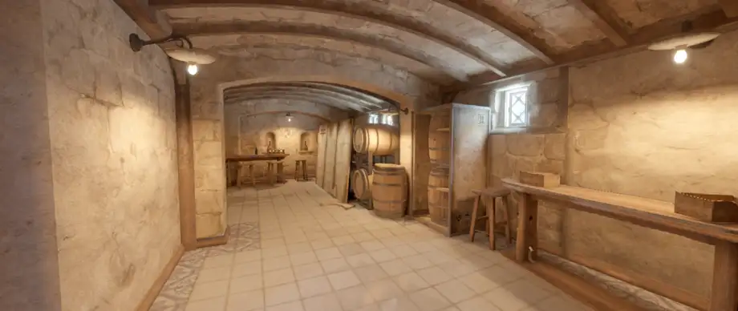
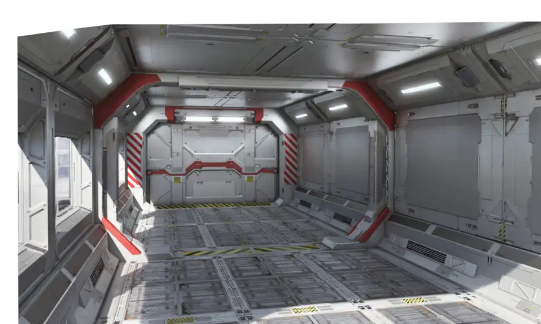
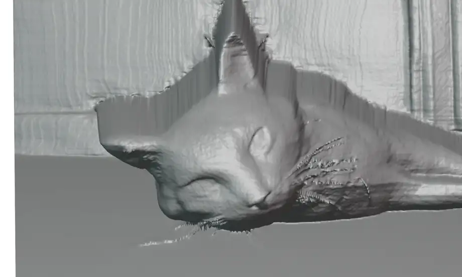
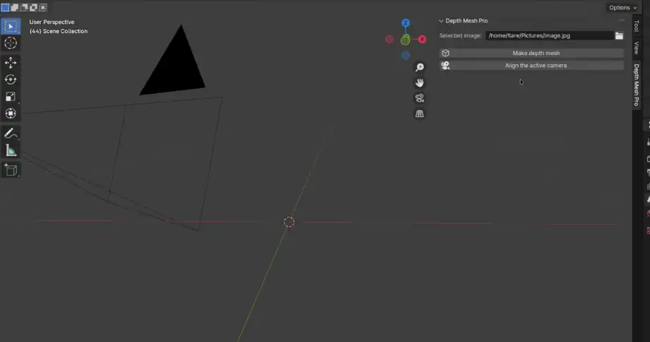

# depthmesh

## Description

Depth Mesh Pro is a Blender extension that creates metrically accurate meshes from images.

Requires Blender 4.2+

Blender 4.2.4 and 4.3.0 are not supported. These two versions have a bug that prevents the extension from installing correctly. To work around this issue you can use older or newer versions (e.g. 4.2.3 or 4.3.1).

Supported on windows, linux and mac

## Examples

Top: input image 
Bottom: resulting mesh

 

 

 

## Usage

1. Choose an image
2. Click the "Make depth mesh" button
3. Use the "Align the active camera" button to match the focal length and resolution of the image and move the camera to the world origin.

 

You can modify the mesh by changing the parameters in the geo nodes modifier:

## Versions:

- CUDA version for NVIDIA GPUs (linux and windows)
- DirectML version for DirectX12 capable GPUs (windows only)
- CPU version (all platforms)

## Requirements:

- For GPU versions: 4GB VRAM
- For CPU version: 8GB RAM and a fairly modern 64bit CPU (e.g. Intel Core i5 8400 or AMD Ryzen 2600)
